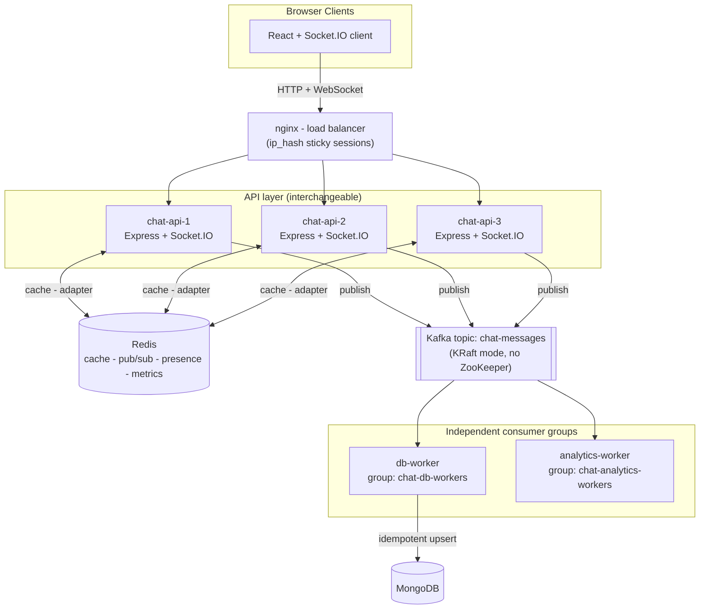
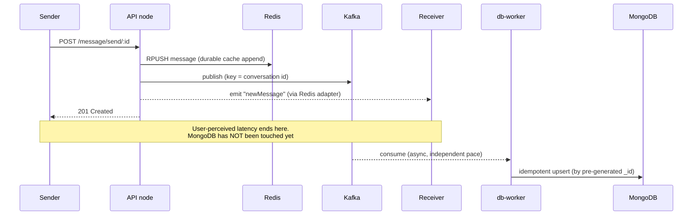

# ChatAppScalable

**A real-time, event-driven chat application built to demonstrate horizontal scaling patterns** — Socket.IO for live delivery, Redis as a durable cache + pub/sub layer, Apache Kafka for decoupled, replayable message persistence, and Docker + nginx for a load-balanced, multi-instance backend.

This isn't just a chat app with a database. It's a small case study in **event-driven architecture**: every message flows through a durable log before it's ever written to the database, the read path survives a database outage, and the whole backend scales horizontally without touching a line of business logic.


**Live:** [Frontend](https://yash-chat-app-brown.vercel.app/) (Vercel) · [Backend health check](https://yashchat-app.malaysiawest.cloudapp.azure.com/healthz) (Azure)

---

## Table of contents

- [Why this project exists](#why-this-project-exists)
- [Key features](#key-features)
- [Architecture](#architecture)
- [The life of a message](#the-life-of-a-message)
- [Tech stack](#tech-stack)
- [Project structure](#project-structure)
- [Getting started](#getting-started)
- [Environment variables](#environment-variables)
- [Available scripts](#available-scripts)
- [Observability dashboard](#observability-dashboard)
- [Load testing](#load-testing)
- [Deployment](#deployment)
- [Documentation](#documentation)
- [Known limitations & roadmap](#known-limitations--roadmap)
- [License](#license)

---

## Why this project exists

Most MERN chat tutorials stop at "Express server + one Socket.IO instance + MongoDB." That works for a demo, but it has four hard scaling walls: a single server is a single point of failure, direct database writes become the bottleneck under load, there's no cache so every read hits the DB, and adding any new capability (analytics, notifications, search) means editing the fragile write path.

This project rebuilds that basic app to remove all four walls: the write path is decoupled through Kafka, reads are served from a Redis-backed durable cache, real-time delivery is fanned out across multiple backend instances via a Redis adapter, and the whole thing runs behind an nginx load balancer with three interchangeable API replicas.

## Key features

**Messaging**
- One-to-one direct messages and multi-user **group chats** (admin-managed membership)
- Image sharing via Cloudinary
- **WhatsApp-style delivery ticks** — sent (single grey) to delivered (double grey) to read (double blue)
- Optimistic UI — your own messages appear instantly, before the server confirms

**Real-time presence & feedback**
- Live online/offline status and **"last seen"** timestamps
- **Typing indicators**, including per-member typing in group chats
- **Unread message badges** per conversation and per group, synced live across devices

**Resilience (the interesting part)**
- Messages are written to Kafka **and** appended to a durable Redis cache before the API responds — the user-facing path never waits on MongoDB
- If the persistence worker goes down, messages keep flowing and remain visible on refresh; the worker catches up automatically once restarted, with **idempotent, duplicate-safe writes**
- Two independent Kafka consumer groups (database persistence + analytics) each receive a full copy of every message — new consumers can be added without touching the API

**Horizontal scaling**
- Three interchangeable Express/Socket.IO API instances behind an **nginx load balancer** (sticky sessions for WebSocket compatibility)
- A Socket.IO **Redis adapter** so real-time events reach a user regardless of which backend instance they're connected to

**Observability**
- A live in-app dashboard: messages/sec, Redis cache hit ratio, **Kafka consumer lag**, and per-instance request distribution — all backed by Redis counters so they aggregate correctly across every API node
- A Prometheus-compatible metrics endpoint

**Security & delivery**
- JWT auth via httpOnly cookies, bcrypt password hashing
- **Arcjet** middleware for bot detection, rate limiting, and shield protection (toggleable for load testing)
- Transactional welcome emails via **Resend**

## Architecture



Four technologies, four jobs:

| Layer | Responsibility |
|---|---|
| **Socket.IO** | Real-time, bidirectional events (messages, ticks, typing, presence) between clients and any API node |
| **Redis** | (1) durable chat-history cache & read source, (2) Socket.IO pub/sub adapter across nodes, (3) presence/unread/metrics counters, (4) hot-path existence checks |
| **Apache Kafka** | A durable, replayable log that decouples message writes from the database; multiple consumer groups fan out independently |
| **Docker + nginx** | Package every service into containers; load-balance three API replicas with sticky sessions |

## The life of a message



The response returns after the message is durably in **Kafka + Redis**, not after MongoDB. Reads are served from the Redis cache first, falling back to MongoDB only on a cold cache — which is why a message never "disappears" on refresh even if the persistence worker is temporarily down.

## Tech stack

**Backend:** Node.js, Express, Socket.IO, KafkaJS, Mongoose (MongoDB), Redis (`redis` client + `@socket.io/redis-adapter`), JWT, bcrypt, Cloudinary, Arcjet, Resend

**Frontend:** React 19, Vite, Zustand, TailwindCSS + DaisyUI, React Router, Axios, Socket.IO client

**Infrastructure:** Docker & Docker Compose, nginx, Apache Kafka (KRaft mode), Redis, MongoDB Atlas

**Testing/Tooling:** k6 (load testing), ESLint

## Project structure

```
ChatAppScalable/
|-- backend/
|   `-- src/
|       |-- controllers/     # message, group, auth request handlers
|       |-- lib/             # kafka.js, redis.js, socket.js, metrics.js, db.js
|       |-- middleware/      # auth, arcjet, socket auth
|       |-- models/          # User, Message, Group (Mongoose schemas)
|       |-- routes/          # Express route definitions
|       |-- email/           # transactional email templates
|       |-- worker.js        # Kafka consumer -> MongoDB (group: chat-db-workers)
|       |-- analytics-worker.js # Kafka consumer -> analytics (group: chat-analytics-workers)
|       `-- server.js        # app entrypoint
|-- frontend/
|   `-- src/
|       |-- components/      # ChatContainer, ChatHeader, ChatList, modals, etc.
|       |-- pages/           # Chatpage, Dashboard, Login, SignUp
|       |-- store/           # Zustand stores (chat, auth)
|       `-- lib/             # axios instance
|-- nginx/
|   `-- nginx.conf           # load balancer config
|-- docker-compose.yml       # full stack (3 API replicas + nginx) - demos scaling
|-- docker-compose.dev.yml   # lightweight (1 API, no nginx) - for local coding
|-- docker-compose.prod.yml  # tuned for cloud VM deployment
|-- loadtest.k6.js           # k6 load test script
|-- KAFKA_GUIDE.md           # deep-dive Kafka concepts mapped to this codebase
|-- DEPLOY_AZURE.md          # Azure for Students deployment guide (no card required)
|-- DEPLOY_ORACLE.md         # Oracle Cloud Always Free deployment guide
`-- ChatAppScalable_Architecture_Notes.pdf  # full architecture revision notes
```

## Getting started

### Prerequisites
- [Docker](https://www.docker.com/) & Docker Compose
- [Node.js](https://nodejs.org/) 18+ (only needed if running the frontend outside Docker)
- A MongoDB connection string (e.g. [MongoDB Atlas](https://www.mongodb.com/atlas) free tier)

### 1. Clone and configure

```bash
git clone https://github.com/YashP1830/Scalable-Chat-APP.git
cd Scalable-Chat-APP
```

Create `backend/.env` (see [Environment variables](#environment-variables) below) and `frontend/.env`:
```
VITE_API_URL=http://localhost/api
```

### 2. Run the backend stack

There are three Docker Compose profiles depending on what you need:

```bash
# Lightweight - 1 API instance, no nginx. Best for everyday development.
docker compose -f docker-compose.dev.yml up -d --build

# Full - 3 API instances behind nginx. Demonstrates the load-balanced architecture.
docker compose -f docker-compose.yml up -d --build

# Production-tuned - for deploying to a cloud VM.
docker compose -f docker-compose.prod.yml up -d --build
```

> **Always rebuild after changing backend code** (`--build`). Docker Desktop's "play" button only restarts existing containers with the old image — it will not pick up code changes.

Verify it's healthy:
```bash
curl http://localhost/healthz   # -> ok
```

### 3. Run the frontend

The frontend runs outside Docker for fast hot-reload:
```bash
cd frontend
npm install
npm run dev
```
Open `http://localhost:5173`.

## Environment variables

`backend/.env`:

| Variable | Purpose |
|---|---|
| `PORT` | API port (default 5000 in Docker) |
| `MONGODB_URI` | MongoDB connection string |
| `NODE_ENV` | `development` or `production` |
| `JWT_SECRET` | Secret for signing auth tokens |
| `CLIENT_URL` | Frontend origin, for CORS |
| `CLOUD_NAME`, `CLOUDINARY_API_KEY`, `CLOUDINARY_API_SECRET` | Cloudinary image uploads |
| `RESEND_API_KEY`, `EMAIL_FROM`, `EMAIL_FROM_NAME` | Transactional email (welcome emails) |
| `ARCJET_API_KEY`, `ARCJET_ENV` | Bot detection / rate limiting |
| `ARCJET_MODE` *(optional)* | `LIVE` (default), `DRY_RUN`, or `OFF` — use `OFF` only for load testing |
| `KAFKA_BROKER`, `REDIS_URL` | Set automatically by Docker Compose; only needed for local (non-Docker) runs |

`frontend/.env`:

| Variable | Purpose |
|---|---|
| `VITE_API_URL` | Base URL the frontend calls (`http://localhost/api` when running behind nginx) |

**Never commit `.env` files** — they're excluded via `.gitignore`.

## Available scripts

| Location | Command | Description |
|---|---|---|
| `backend/` | `npm run dev` | Start the API with nodemon (local, non-Docker) |
| `backend/` | `npm start` | Start the API (production mode) |
| `backend/` | `node src/worker.js` | Run the database persistence worker |
| `backend/` | `node src/analytics-worker.js` | Run the analytics worker |
| `frontend/` | `npm run dev` | Vite dev server with hot reload |
| `frontend/` | `npm run build` | Production build |

## Observability dashboard

Once logged in, click the activity icon in the profile header (or visit `/dashboard`) for a live view of:

- Online users, messages/sec, Redis cache hit ratio
- **Kafka consumer lag** for both the persistence and analytics consumer groups
- The produced -> persisted message pipeline
- Request distribution across API instances

All metrics are Redis-backed counters, so they aggregate correctly no matter which of the three API instances served a given request. A Prometheus-format endpoint is also available at `/api/metrics/prometheus`.

## Load testing

A [k6](https://k6.io/) script (`loadtest.k6.js`) simulates realistic concurrent usage — authenticating, sending messages, and reading history — ramping up to 100 virtual users.

```bash
# quick 10-second smoke test
k6 run -e SMOKE=1 -e BASE_URL=http://localhost loadtest.k6.js

# full ~3 minute ramp test
k6 run -e BASE_URL=http://localhost loadtest.k6.js

# peak-throughput mode (no simulated "think time" between requests)
k6 run -e STRESS=1 -e BASE_URL=http://localhost loadtest.k6.js
```

> Arcjet must not be in `LIVE` mode during a load test, or k6 will be blocked as a bot. Set `ARCJET_MODE=DRY_RUN` or `OFF` before running.

A representative run: **100 concurrent users, 12,000+ requests, 0% error rate, 100% checks passed** on a single development machine against a free-tier MongoDB cluster.

## Deployment

The full stack (including self-hosted Kafka) is deployed on a single cloud VM, since free *managed* Kafka is effectively unavailable. Two guides are included depending on eligibility:

- **[DEPLOY_AZURE.md](./DEPLOY_AZURE.md)** — Azure for Students ($100 credit, no credit card required at signup) — used for the live deployment of this project
- **[DEPLOY_ORACLE.md](./DEPLOY_ORACLE.md)** — Oracle Cloud Always Free tier (free-forever, but requires card verification at signup)

## Documentation

This repo includes deep-dive reference material beyond this README:

- **[KAFKA_GUIDE.md](./KAFKA_GUIDE.md)** — Kafka concepts (topics, partitions, consumer groups, KRaft, delivery semantics) explained against this project's actual code, plus an interview Q&A bank
- **[DEPLOY_AZURE.md](./DEPLOY_AZURE.md)** / **[DEPLOY_ORACLE.md](./DEPLOY_ORACLE.md)** — free-tier cloud deployment guides
- **[ChatAppScalable_Architecture_Notes.pdf](./ChatAppScalable_Architecture_Notes.pdf)** — a complete, diagrammed architecture and revision guide covering every subsystem, feature, and bug fixed along the way

## Known limitations & roadmap

Being upfront about the current state:

- Single Kafka broker (replication factor 1) — a real single point of failure; production would run a multi-broker cluster
- No dead-letter queue for permanently failing messages
- Group chats don't yet have per-member read receipts (DM read receipts are fully implemented)
- No schema registry — messages are raw JSON over Kafka
- A notification service (offline-user alerts via a dedicated Kafka consumer group) is planned but not yet built

## License

ISC
